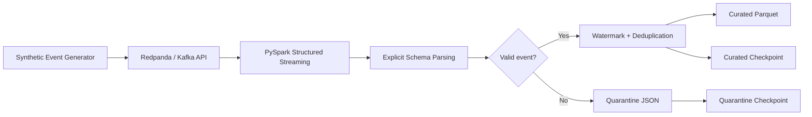

# Healthcare Streaming Pipeline

A production-minded streaming data engineering portfolio project built with **Kafka-compatible messaging (Redpanda)**, **PySpark Structured Streaming**, explicit schema validation, event-time deduplication, quarantine handling, and restart-safe checkpointing.

> **Privacy note:** This repository uses only synthetic data and generic architecture patterns. It contains no employer code, proprietary schemas, screenshots, credentials, or real patient information.

## Why I built this

Getting a streaming job to consume messages is the easy part. Production systems also need to behave correctly when events are duplicated, delayed, malformed, replayed, or processed after a restart.

This project focuses on those reliability concerns rather than just the happy path.

## Architecture



## What this demonstrates

- Event-driven ingestion with Kafka-compatible messaging
- Fully synthetic healthcare-style events
- Deterministic event identifiers for idempotency
- PySpark Structured Streaming
- Explicit schemas and required-field validation
- Event-time processing and watermarking
- Duplicate handling within a bounded state window
- Invalid-record quarantine rather than silent data loss
- Independent checkpointing and restart-safe processing
- Unit tests and GitHub Actions CI

## Event contract

Each message is a synthetic normalized healthcare event rather than a real HL7 payload.

```json
{
  "event_id": "evt_b840de24d133b784930f",
  "patient_id": "pt_4821",
  "event_type": "ADT",
  "facility_id": "facility_03",
  "event_timestamp": "2026-10-01T14:22:10+00:00",
  "source_system": "synthetic_ehr",
  "payload": {
    "visit_type": "ER",
    "status": "admitted"
  }
}
```

Supported event categories are `ADT`, `ORU`, and `MDM` to mirror common healthcare integration concepts without using proprietary message structures.

## Repository structure

```text
.
├── .github/workflows/ci.yml
├── docs/
│   └── architecture.md
├── sample_data/
│   └── example_event.json
├── src/
│   ├── __init__.py
│   ├── event_model.py
│   ├── generate_events.py
│   ├── identifiers.py
│   └── spark_stream.py
├── tests/
│   └── test_event_schema.py
├── docker-compose.yml
├── requirements.txt
└── README.md
```

## Quick start

### Prerequisites

- Python 3.11
- Docker Desktop
- Java 8, 11, or 17 for PySpark

### 1. Create a virtual environment

```bash
python3 -m venv .venv
source .venv/bin/activate
pip install --upgrade pip
pip install -r requirements.txt
```

### 2. Start Redpanda

```bash
docker compose up -d
```

### 3. Generate synthetic events

The producer intentionally repeats about 10% of messages by default so the streaming job has duplicates to remove.

```bash
python -m src.generate_events --count 100 --duplicate-rate 0.10
```

### 4. Run the streaming job

```bash
spark-submit \
  --packages org.apache.spark:spark-sql-kafka-0-10_2.12:3.5.1 \
  src/spark_stream.py
```

Outputs are written locally to:

```text
data/curated/events/
data/quarantine/events/
data/checkpoints/
```

### 5. Run unit tests

```bash
pytest -q
```

### 6. Stop the broker

```bash
docker compose down
```

## Reliability patterns

| Concern | Pattern used |
|---|---|
| Duplicate delivery | Deterministic `event_id` + streaming deduplication |
| Late events | Event-time watermark |
| Malformed/invalid records | Quarantine output with raw JSON retained |
| Job restart | Spark checkpointing |
| Schema drift / bad contracts | Explicit parsing and validation boundary |
| Reprocessing | Stable identifiers make idempotent behavior easier to reason about |

## Design tradeoffs

This is intentionally a portfolio-sized reference implementation. Parquet keeps the local setup simple, while a production lakehouse would typically use Delta Lake or Iceberg plus managed orchestration, observability, access controls, and centralized schema management.

More detail is in [`docs/architecture.md`](docs/architecture.md).

## Possible next steps

- Replace the Parquet curated layer with Delta Lake
- Add a Schema Registry and versioned contracts
- Add a dead-letter topic for invalid Kafka messages
- Add OpenTelemetry/Prometheus metrics
- Add Great Expectations or Deequ-style checks
- Deploy a managed version with Terraform
- Add synthetic FHIR-shaped event variants

## About this project

I built this repository as a public demonstration of the streaming and reliability patterns I use when thinking about real-world data engineering systems. The healthcare context is synthetic and generalized by design.
