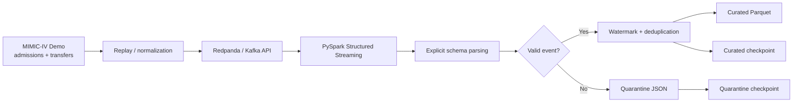

# Healthcare Streaming Pipeline

[](https://github.com/Jayanth2429/healthcare-streaming-pipeline/actions/workflows/ci.yml)

A production-minded streaming data engineering project built with **public deidentified clinical data from the MIMIC-IV Clinical Database Demo**, **Kafka-compatible messaging (Redpanda)**, **PySpark Structured Streaming**, explicit schema validation, event-time deduplication, quarantine handling, and restart-safe checkpointing.

## Why this project exists

Getting a streaming job to consume messages is the easy part. Production systems also need to behave correctly when events are duplicated, delayed, malformed, replayed, or processed after a restart.

This project uses historical public clinical records as the source, converts them to a normalized event contract, and replays them in event-time order to exercise those reliability patterns.

> MIMIC-IV Demo is deidentified, open-access data. Raw source files are downloaded from PhysioNet at runtime and are not committed to this repository. See [`DATA_SOURCES.md`](DATA_SOURCES.md) for attribution and license details.

## Architecture



## What this demonstrates

- Real public healthcare data as the pipeline source
- Historical-event replay through Kafka-compatible messaging
- Deterministic event identifiers for idempotency
- PySpark Structured Streaming
- Explicit schemas and required-field validation
- Event-time processing and watermarking
- Duplicate handling within a bounded state window
- Invalid-record quarantine rather than silent data loss
- Independent checkpointing and restart-safe processing
- Unit tests and GitHub Actions CI

## Public source data

The project uses the open-access **MIMIC-IV Clinical Database Demo v2.2**, a deidentified 100-patient subset published on PhysioNet. The demo contains the same schema structure as MIMIC-IV and excludes free-text clinical notes.

This project currently uses:

- `hosp/admissions.csv.gz`
- `hosp/transfers.csv.gz`

The source is historical. The project explicitly **replays** those records as a stream; it does not imply that MIMIC data was originally delivered through Kafka.

## Event contract

Source rows are normalized into three event categories:

- `ADMISSION`
- `DISCHARGE`
- `TRANSFER`

Example shape:

```json
{
  "event_id": "evt_...",
  "subject_id": "10000032",
  "hadm_id": "22595853",
  "event_type": "ADMISSION",
  "event_timestamp": "2180-05-06T22:23:00",
  "source_table": "admissions",
  "source_record_id": "22595853:admit",
  "care_unit": null,
  "payload": {
    "admission_type": "URGENT",
    "admission_location": "TRANSFER FROM HOSPITAL"
  }
}
```

## Repository structure

```text
.
├── .github/workflows/ci.yml
├── docs/
│   └── architecture.md
├── scripts/
│   └── download_mimic_demo.py
├── src/
│   ├── event_model.py
│   ├── identifiers.py
│   ├── replay_mimic_events.py
│   └── spark_stream.py
├── tests/
│   └── test_event_schema.py
├── DATA_SOURCES.md
├── docker-compose.yml
├── requirements.txt
└── README.md
```

## Quick start

### 1. Create a virtual environment

```bash
python3 -m venv .venv
source .venv/bin/activate
python -m pip install --upgrade pip
python -m pip install -r requirements.txt
```

### 2. Download the public source tables

```bash
python scripts/download_mimic_demo.py
```

### 3. Start Redpanda

```bash
docker compose up -d
```

### 4. Replay MIMIC events

```bash
python -m src.replay_mimic_events --max-events 500
```

Optional fault injection can deliberately republish a fraction of real source events so the deduplication path can be observed:

```bash
python -m src.replay_mimic_events --max-events 500 --duplicate-rate 0.05
```

### 5. Run the streaming job

```bash
spark-submit \
  --packages org.apache.spark:spark-sql-kafka-0-10_2.12:3.5.1 \
  src/spark_stream.py
```

Outputs are written locally to `data/curated/`, `data/quarantine/`, and `data/checkpoints/`.

### 6. Run unit tests

```bash
python -m pytest -q
```

## Reliability patterns

| Concern | Pattern used |
|---|---|
| Duplicate delivery | Deterministic `event_id` + streaming deduplication |
| Late events | Event-time watermark |
| Malformed/invalid records | Quarantine output with raw JSON retained |
| Job restart | Spark checkpointing |
| Schema drift / bad contracts | Explicit parsing and validation boundary |
| Reprocessing | Stable identifiers make replay behavior idempotent |

## Data ethics and scope

MIMIC-IV Demo is deidentified research data. This repository does not contain employer data, production patient data, proprietary schemas, credentials, or internal business logic. The raw MIMIC files remain outside Git and are governed by the source dataset's license.

See [`DATA_SOURCES.md`](DATA_SOURCES.md) for source, license, and citation details.
